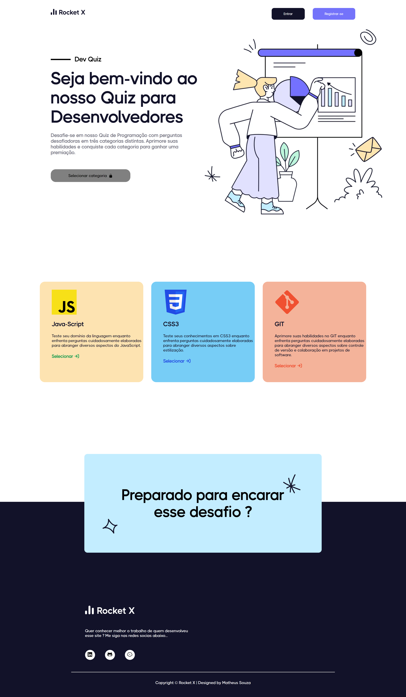
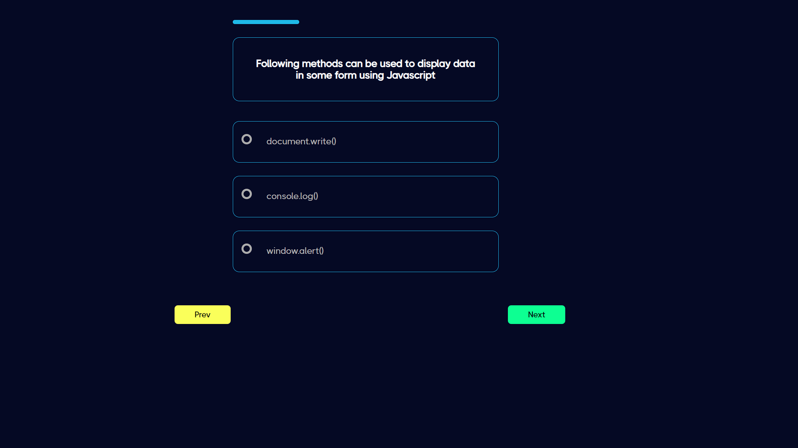

<a href="https://rocket-x-orpin.vercel.app/"> <h1 align="center" > Rocket-X </h1> </a>

 

 
 
 

#  📝 Descrição do projeto

Rocket-x é uma plataforma de quiz interativa, voltada especificamente para desenvolvedores, projetada para oferecer uma experiência divertida e educativa ao testar e aprimorar conhecimentos em tecnologias específicas. Desenvolvida com uma arquitetura full-stack, integra o front-end com um container Docker construído para o back-end.

A implementação de um pipeline de Continuous Integration (CI) foi realizada para executar testes, garantindo a qualidade do código. Testes unitários e de integração foram implementados em ambos os lados da aplicação, utilizando Redux para gerenciamento de estado no front-end, visando uma base de código robusta e escalável. Além disso, testes end-to-end (e2e) foram conduzidos com Cypress no front-end, permitindo uma verificação completa do fluxo do usuário e da funcionalidade da aplicação.

 

# 🚀 Tecnologias e bibliotecas

Esse projeto está sendo desenvolvido com as seguintes tecnologias:

Front-end
- React.JS
- Typescript
- Redux Toolkit
- Cypress
- React Toastify
- React Icons
- Axios
- styled-components

Back-end
- NodeJS
- Typescript
- Jest
- Supertest
- Express
- Nodemon
- Bcrypt
- Cookie-parser
- Json Web Token
- Cors
   
Banco de dados:  
- MongoDB

# ⏭️ Atualizações futuras

- Responsividade para mobile
- Adição de + 2 categorias para o quiz

